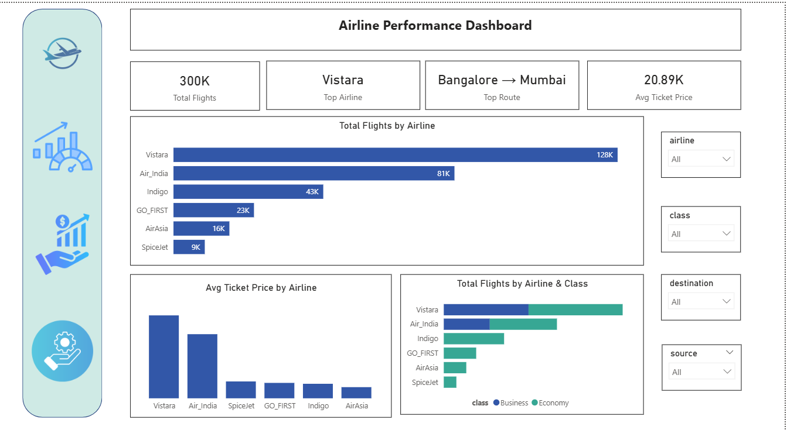
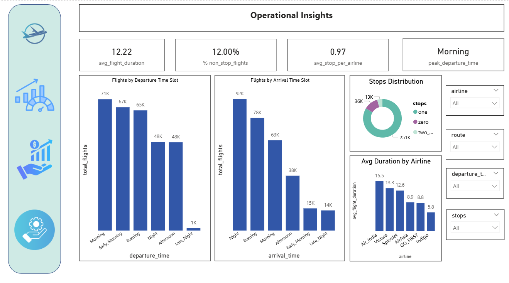

# airline-analytics-Power-BI

## Project Overview
This project focuses on analyzing airline data to uncover **performance trends, revenue analysis, pricing patterns and operational insights**.

The project is divided into **three dashboards**:
1. Airline Performance
2. Revenue & Pricing Insights
3. Operational Insights

## Objectives
- Analyze airline performance across routes and carriers
- Identify top and low-performing routes and airlines
- Understand pricing distribution and revenue contribution
- Build interactive dashboards for business users

## Dashboard Preview

### Airline Performance Dashboard

### Revenue & Pricing Insights Dashboard

### Operational Insights Dashboard

## Tools Used
- Power BI
- DAX
- Excel/ CSV

## Key Learning ##
- Hands-on experience with DAX Calculations
- Designing business-oriented dashboards
- Converting raw airline data into actionable insights
- Understanding airline pricing and operational patterns
